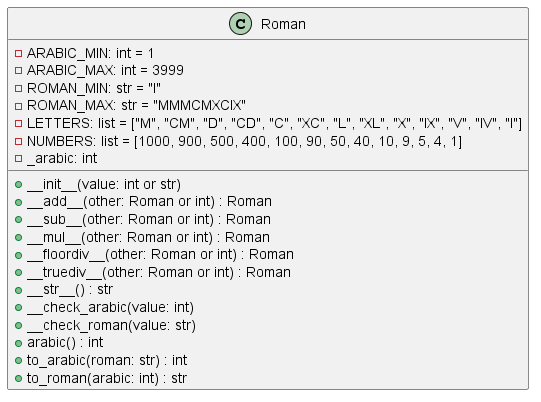

# Неделя 3, задани 1
## **Тема**: Объектно-ориентированное программирование на Python 
### Студентки группы ПИЖ-б-о-23-1(1) Алдабаевой Виктории Владимировны
#### Репозиторий Git: https://github.com/Pharrower/pizh2311_Aldabaeva <br><br>
**Номер варианта: 2**  
*Задание:*  
4.3.1. Римское число
Создайте класс Roman (Римское число), представляющий римское число
и поддерживающий операции +, -, *, /.
При реализации класса следуйте рекомендациям:
- операции +, -, *, / реализуйте как специальные методы (__add__ и др.);
- методы преобразования имеет смысл реализовать как статические методы, 
позволяя не создавать экземпляр объекта в случае, если необходимо выполнить
только преобразование чисел.
При выполнении задания необходимо построить UML-диаграмму классов приложения

*Ответ:* 

*roman.py*
```python
class Roman:
    """Класс Roman реализует работу с римскими числами.

    Алгоритм: http://math.hws.edu/eck/cs124/javanotes7/c8/ex3-ans.html.

    Внутри класс работает с обычными арабскими числами (int),
    которые преобразуются в римские при необходимости (например, при выводе).

    Ключевой атрибут: self._arabic (арабское число).

    Ограничения: число должно быть в пределах [1; 3999].
    """

    # Константы класса
    ARABIC_MIN = 1
    ARABIC_MAX = 3999
    ROMAN_MIN = "I"
    ROMAN_MAX = "MMMCMXCIX"

    LETTERS = ["M", "CM", "D", "CD", "C", "XC", "L",
               "XL", "X", "IX", "V", "IV", "I"]
    NUMBERS = [1000, 900, 500, 400, 100, 90, 50, 40, 10, 9, 5, 4, 1]

    def __init__(self, value):
        """Инициализация класса.

        Параметры:
            value (str): римское число, например, X.
                или
            value (int): арабское число, например, 5.
                или
            value (другой тип):  возбудить исключение TypeError.
        """
        if not isinstance(value, (int, str)):
            raise TypeError("Не могу создать римское число из {0}".
                            format(type(value)))

        if isinstance(value, int):
            self.__check_arabic(value)
            self._arabic = value
        elif isinstance(value, str):
            self._arabic = self.to_arabic(value)

    def __add__(self, other):
        """Создать новый объект как сумму 'self' и 'other'.

        Параметры:
            other (Roman): ...
                или
            other (int): арабское число, добавить к self.
                или
            other (другой тип):  возбудить исключение TypeError.
        """
        if isinstance(other, Roman):
            return Roman(self._arabic + other._arabic)
        elif isinstance(other, int):
            return Roman(self._arabic + other)
        else:
            raise TypeError("Не могу сложить римское число с {0}".
                            format(type(value)))

    def __sub__(self, other):
        """Создать новый объект как разность self и other.

        Параметры:
            other (Roman): ...
                или
            other (int): арабское число, добавить к self.
                или
            other (другой тип):  возбудить исключение TypeError.
        """
        if isinstance(other, Roman):
            return Roman(self._arabic - other._arabic)
        elif isinstance(other, int):
            return Roman(self._arabic - other)
        else:
            raise TypeError("Не могу вычесть из римского числа {0}".
                            format(type(value)))

    def __mul__(self, other):
        """Создать новый объект как произведение self и other.

        Параметры:
            other (Roman): ...
                или
            other (int): арабское число, добавить к self.
                или
            other (другой тип):  возбудить исключение TypeError.
        """
        if isinstance(other, Roman):
            return Roman(self._arabic * other._arabic)
        elif isinstance(other, int):
            return Roman(self._arabic * other)
        else:
            raise TypeError("Не могу умножить римское число на {0}".
                            format(type(value)))

    def __floordiv__(self, other):
        """Создать новый объект как частное self и other.

        Параметры:
            other (Roman): ...
                или
            other (int): арабское число, добавить к self.
                или
            other (другой тип):  возбудить исключение TypeError.
        """
        if isinstance(other, Roman):
            return Roman(self._arabic // other._arabic)
        elif isinstance(other, int):
            return Roman(self._arabic // other)
        else:
            raise TypeError("Не могу разделить римское число на {0}".
                            format(type(value)))

    def __truediv__(self, other):
        """Создать новый объект как частное self и other.

        Параметры:
            other (Roman): ...
                или
            other (int): арабское число, добавить к self.
                или
            other (другой тип):  возбудить исключение TypeError.
        """
        # Любое деление для римского числа считается делением нацело,
        # поэтому необходимо передать "работу" реализованному методу
        # целочисленного деления
        return self.__floordiv__(other)

    def __str__(self):
        """Вернуть строковое представление класса."""
        return Roman.to_roman(self._arabic)

    @staticmethod
    def __check_arabic(value):
        """Возбудить исключение ValueError, если 'value' не принадлежит
        [ARABIC_MIN; ARABIC_MIN]."""
        if not Roman.ARABIC_MIN <= value <= Roman.ARABIC_MAX:
            raise ValueError("Число должно быть в пределах [{0}; {1}]".format(
                Roman.ARABIC_MIN, Roman.ARABIC_MAX))

    @staticmethod
    def __check_roman(value):
        """Возбудить исключение ValueError, если 'value' содержит
        недопустимые символы (не входящие в LETTERS)."""
        for char in value:
            if char not in Roman.LETTERS:
                raise ValueError("Недопустимый символ в римском числе: {0}".format(char))

    @property
    def arabic(self):
        """Вернуть арабское представление числа."""
        return self._arabic

    @staticmethod
    def to_arabic(roman):
        """Преобразовать римское число 'roman' в арабское.

        Параметры:
            roman (str): римское число, например, "X".

        Возвращает:
            int: арабское число.
        """
        def letter_to_number(letter):
            """Вернуть арабское значение римской цифры 'letter'.

            Регистр не учитывается."""
            return Roman.NUMBERS[Roman.LETTERS.index(letter)]

        Roman.__check_roman(roman)

        i = 0  # Позиция в строке roman
        value = 0  # Преобразованное число

        while i < len(roman):

            number = letter_to_number(roman[i])

            i += 1

            if i == len(roman):
                # В строке roman больше не осталось символов, добавляем number
                value += number
            else:
                # Если символы остались, необходимо посмотреть на следующий.
                # Если следующий символ "больше", считаем их за одну цифру.
                # Это необходимо, например, для того,
                # чтобы IV преобразовать в 4, а не 15.
                next_number = letter_to_number(roman[i])
                if next_number > number:
                    # Комбинируем цифры и перемещаем i к следующей
                    value += next_number - number
                    i += 1
                else:
                    # Просто добавляем следующую цифру
                    value += number

        Roman.__check_arabic(value)
        return value

    @staticmethod
    def to_roman(arabic):
        """Преобразовать арабское число 'arabic' в римское.

        Параметры:
            arabic (int): арабское число, например, 5.

        Возвращает:
            str: римское число.
        """
        Roman.__check_arabic(arabic)

        roman = ""
        # n - часть arabic, которую осталось преобразовать
        n = arabic

        for i, number in enumerate(Roman.NUMBERS):
            while n >= number:
                roman += Roman.LETTERS[i]
                n -= Roman.NUMBERS[i]

        return roman
```  

*main.py*
```python
from roman import Roman

if __name__ == "__main__":

    r1 = Roman("X")
    r2 = Roman(5)

    print("       Числа:", r1, r2, r1.arabic, r2.arabic)
    print("       Сумма:", r1 + r2)
    print("    Разность:", r1 - r2)
    print("Произведение:", r1 * r2)
    print("     Частное:", r1 // r2)

    print("\nПреобразование без создания объекта:")
    print(2016, "=", Roman.to_roman(2016))
    print("MMXVI", "=", Roman.to_arabic("MMXVI"))
```


*Вывод программы:*  
       Числа: X V 10 5<br>
       Сумма: XV<br>
    Разность: V<br>
Произведение: L<br>
     Частное: II<br>

Преобразование без создания объекта:<br>
2016 = MMXVI<br>
MMXVI = 2016<br>

**UML** <br>
