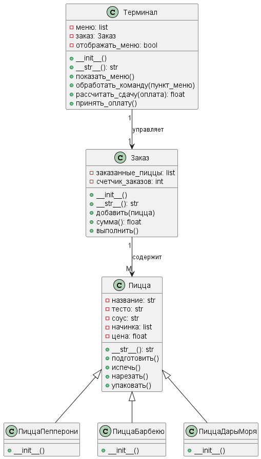

# Неделя 3, задание 2
## **Тема**: Объектно-ориентированное программирование на Python 
### Студентки группы ПИЖ-б-о-23-1(1) Алдабаевой Виктории Владимировны
#### Репозиторий Git: https://github.com/Pharrower/pizh2311_Aldabaeva <br><br>
**Номер варианта: 2**  
*Задание:*  
4.3.2. Пиццерия
Пиццерия предлагает клиентам три вида пиццы: Пепперони, Барбекю и Дары моря, каждая
из которых определяется тестом, соусом и начинкой.
Требуется спроектировать и реализовать приложение для терминала, позволяющее
обеспечить обслуживание посетителей
*Дополнительная информация*
В бизнес-процессе работы пиццерии в контексте задачи можно выделить 3 объекта:
1. Терминал: отвечает за взаимодействие с пользователем:
    - вывод меню на экран;
    - приём команд от пользователя (выбор пиццы, подтверждение заказа, оплата и др.);
2. Заказ: содержит список заказанных пицц, умеет подсчитывать свою стоимость;
3. Пицца: содержит заявленные характеристики пиццы, а также умеет себя подготовить
(замесить тесто, собрать ингредиенты и т.д.), испечь, порезать и упаковать.

*Ответ:* 

*main.py*
```python
from терминал import Терминал

if __name__ == "__main__":

    терминал1 = Терминал()
    print(терминал1)
    while True:
        терминал1.показать_меню()
        пункт_меню = input()
        терминал1.обработать_команду(пункт_меню)
```  

*заказ.py*
```python
import time


class Заказ:
    """Класс Заказ содержит информацию о заказе."""

    # Переменная класса для определения номера заказа
    счетчик_заказов = 0

    def __init__(self):
        """Конструктор класса."""
        # Хранит экземпляры класса Пицца и его потомков
        self.заказанные_пиццы = []
        Заказ.счетчик_заказов += 1

    def __str__(self):
        """Вернуть содержимое заказа и его сумму.

        Формат вывода:

        Заказ №2
        1. Пицца: Пепперони | Цена: 350.00 р.
           Тесто: тонкое Соус: томатный
           Начинка: пепперони, сыр моцарелла
        2. Пицца: Барбекю | Цена: 450.00 р.
           Тесто: тонкое Соус: барбекю
           Начинка: бекон, ветчина, зелень, сыр моцарелла
        Сумма заказа: 800.00 р.

        """
        res = f"Заказ №{self.счетчик_заказов}\n"
        for i, пицца in enumerate(self.заказанные_пиццы, 1):
            res += f"{i}. {пицца}\n"
        res += f"Сумма заказа: {self.сумма()} р.\n"
        return res

    def добавить(self, пицца):
        """Добавить пиццу в заказ."""
        self.заказанные_пиццы.append(пицца)
        return f"Пицца {пицца} добавлена!"

    def сумма(self):
        """Вернуть сумму заказа."""
        return sum(пицца.цена for пицца in self.заказанные_пиццы)

    def выполнить(self):
        """Выполнить заказ.

        Для каждой пиццы в заказе: подготовить, испечь, нарезать и упаковать.
        Сообщить, что заказ готов и пожелать приятного аппетита.

        Для визуального эффекта, каждое действие осуществляется с "задержкой",
        используя time.sleep(1).

        Формат вывода:

        Заказ поступил на выполнение...
        1. Пепперони
        Начинаю готовить пиццу Пепперони
          - замешиваю тонкое тесто...
          - добавляю соус: томатный...
          - и, конечно: пепперони, сыр моцарелла...
        Выпекаю пиццу... Готово!
        Нарезаю на аппетитные кусочки...
        Упаковываю в фирменную упаковку и готово!

        Заказ №2 готов! Приятного аппетита!
        """
        print("Заказ поступил на выполнение ...")
        for i, пицца in enumerate(self.заказанные_пиццы, 1):
            print(f"{i}. {пицца.название}")
            пицца.подготовить()
            time.sleep(1)
            пицца.испечь()
            time.sleep(1)
            пицца.нарезать()
            time.sleep(1)
            пицца.упаковать()
            time.sleep(1)
        print(f"\nЗаказ №{self.счетчик_заказов} готов! Приятного аппетита!\n")
        time.sleep(5)
```

*пицца.py*
```python
import time


class Пицца:
    """Класс Пицца содержит общие атрибуты для пиццы.

    Дочерние классы будут их конкретизировать.
    """

    def __init__(self):
        """Конструктор класса.

        Инициализирует атрибуты пиццы (значения по умолчанию).
        """
        self.название = "Заготовка"
        self.тесто = "тонкое"  # тонкое или пышное
        self.соус = "кечтуп"   # или другой
        self.начинка = []      # список начинок (по умолчанию - нет)

        self.цена = 0

    def __str__(self):
        """Вернуть информацию о пицце: название, тесто, соус, начинка.

        Формат вывода:

        Пицца: Пепперони | Цена: 350.00 р.
        Тесто: тонкое Соус: томатный
        Начинка: пепперони, сыр моцарелла
        """
        return f"Пицца: {self.название} | Цена: {self.цена} р.\nТесто: {self.тесто}, Соус: {self.соус} \nНачинка: {", ".join(self.начинка)}"

    def подготовить(self):
        """Сообщить о процессе подготовки.

        Формат вывода:

        Начинаю готовить пиццу Пепперони
          - замешиваю тонкое тесто...
          - добавляю соус: томатный...
          - и, конечно: пепперони, сыр моцарелла...
        """
        time.sleep(1)
        print(f"Начинаю готовить пиццу {self.название}")
        time.sleep(1)
        print(f"    - замешиваю {self.тесто} тесто ...")
        time.sleep(1)
        print(f"    - добавляю соус: {self.соус} ...")
        time.sleep(1)
        print(f"    - и, конечно: {', '.join(self.начинка)}")

    def испечь(self):
        """Сообщить о процессе запекания пиццы.

        Формат вывода: произвольное сообщение.
        """
        print("Запекаю пиццу")

    def нарезать(self):
        """Сообщить о процессе нарезки.

        Формат вывода: произвольное сообщение.
        """
        print("Нарезаю пиццу")

    def упаковать(self):
        """Сообщить о процессе упаковки.

        Формат вывода: произвольное сообщение.
        """
        print("Упаковываю пиццу")


class ПиццаПепперони(Пицца):
    """Класс ПиццаПепперони дополняет класс Пицца."""

    def __init__(self):
        super().__init__()
        self.название = "Пепперони"
        self.тесто = "Тонкое"
        self.соус = "Томатный"
        self.начинка = ["Пепперони", "сыр моцарелла"]
        self.цена = 350.00


class ПиццаБарбекю(Пицца):
    """Класс ПиццаБарбекю дополняет класс Пицца."""

    def __init__(self):
        super().__init__()
        self.название = "Барбекю"
        self.тесто = "Тонкое"
        self.соус = "Барбекю"
        self.начинка = ["Бекон", "ветчина", "зелень", "сыр моцарелла"]
        self.цена = 450.00


class ПиццаДарыМоря(Пицца):
    """Класс ПиццаДарыМоря дополняет класс Пицца."""

    def __init__(self):
        super().__init__()
        self.название = "Дары моря"
        self.тесто = "Тонкое"
        self.соус = "Томатный"
        self.начинка = ["Кальмары", "креветки", "мидии", "сыр моцарелла"]
        self.цена = 550.00
```

*терминал.py*
```python
from пицца import ПиццаПепперони, ПиццаБарбекю, ПиццаДарыМоря
from заказ import Заказ

class Терминал:
    """Класс Терминал обеспечивает взаимодействие с клиентом."""

    КОМПАНИЯ = "Вкусная пицца, хорошая пицца!"
    КОМАНДА_ОТМЕНА_ЗАКАЗА = -1
    КОМАНДА_ПОДТВЕРЖДЕНИЕ_ЗАКАЗА = 0

    def __init__(self):
        """Конструктор класса.

        self.меню: список доступных пицц;
        self.заказ: список заказанных пицц;
        self.отображать_меню: определяет отображение меню
                              равен True: при создании терминала,
                              после отмены или подтверждения заказа.
        """
        # Доступные пиццы
        self.меню = [ПиццаПепперони(), ПиццаБарбекю(), ПиццаДарыМоря()]
        self.заказ = None
        self.отображать_меню = True

    def __str__(self):
        """Вернуть строковое представление класса.

        Формат вывода:

        Имя пиццерии, версия программы.
        """
        return f"{self.КОМПАНИЯ}, версия 1.0"

    def показать_меню(self):
        """Показать меню.

        Показать меню следует только при наличии флага self.отображать_меню
        self.отображать_меню устанавливается в False после вывода меню.

        Формат вывода:

        Пиццерия #1
        Добро пожаловать!

        Меню:
        1. Пицца: Пепперони | Цена: 350.00 р.
           Тесто: тонкое Соус: томатный
           Начинка: пепперони, сыр моцарелла
        2. Пицца: Барбекю | Цена: 450.00 р.
           Тесто: тонкое Соус: барбекю
           Начинка: бекон, ветчина, зелень, сыр моцарелла
        3. Пицца: Дары моря | Цена: 550.00 р.
           Тесто: пышное Соус: тар-тар
           Начинка: кальмары, креветки, мидии, сыр моцарелла
        Для выбора укажите цифру через <ENTER>.
        Для отмены заказа введите -1
        Для подтверждения заказа введите 0
        """
        if not self.отображать_меню:
            return

        print(f"{self.КОМПАНИЯ}")
        print("Добро пожаловать!\n")
        print("Меню:")
        for i, пицца in enumerate(self.меню, 1):
            print(f"{i}. {пицца}")
        print("\nДля выбора укажите цифру через <ENTER>.")
        print("Для отмены заказа введите -1")
        print("Для подтверждения заказа введите 0")
        self.отображать_меню = False

    def обработать_команду(self, пункт_меню):
        """Обработать действие пользователя.

        Аргументы:
          - пункт_меню (str): выбор пользователя.

        Возможные значения "пункт_меню":
          - -1: отменить заказ;
          -  0: подтвердить заказ; при этом осуществляется
                выставление счета, оплата, а также выполняется заказ;
                после заказ удаляется (= None)
          - 1..len(self.меню): добавление пиццы к добавить_к_заказу;
                               если заказ не создан, его нужно создать.
          - иначе: сообщить о невозможности обработать команду.

        Каждое действие подтверждается выводом на экран, например:
        1
        Пицца Пепперони добавлена!
        2
        Пицца Барбекю добавлена!
        0
        Заказ подтвержен.
        """

        try:
            пункт_меню = int(пункт_меню)
            if пункт_меню == Терминал.КОМАНДА_ОТМЕНА_ЗАКАЗА:
                print("Заказ отменён.")
                self.заказ = None
                self.отображать_меню = True

            elif пункт_меню == Терминал.КОМАНДА_ПОДТВЕРЖДЕНИЕ_ЗАКАЗА:
                print("Заказ подтверждён.")
                print(f"Вы заказали:\n{self.заказ}")
                self.принять_оплату()
                self.заказ.выполнить()
                self.заказ = None
                self.отображать_меню = True
 
            elif 1 <= пункт_меню <= len(self.меню):
                if self.заказ is None:
                    self.заказ = Заказ()
                пицца = self.меню[пункт_меню - 1]
                self.заказ.добавить(пицца)
                print(f"Пицца {пицца.название} добавлена!")
            else:
                # За границей меню передаем управление в обработку исключений
                raise ValueError
        except ValueError:
            print("Не могу распознать команду! Проверьте ввод.")
        except Exception:
            print("Во время работы терминала произошла ошибка...")

    def рассчитать_сдачу(self, оплата):
        """Вернуть сдачу для 'оплата'.

        Если оплата меньше стоимости заказа, возбудить исключение ValueError.
        """
        сумма_заказа = self.заказ.сумма()
        if оплата < сумма_заказа:
            raise ValueError("Оплата меньше суммы заказа")
        return оплата - сумма_заказа

    def принять_оплату(self):
        """Обработать оплату.

        Эмулирует оплату заказа (клиент вводит сумму с клавиатуры).

        Если сумма оплаты недостаточна (определяет метод рассчитать_сдачу())
        или возникает другая ошибка - исключние передается выше.
        """
        try:
            сумма_заказа = self.заказ.сумма()
            print(f"Сумма заказа: {сумма_заказа} р.")
            оплата = float(input("Введите сумму для оплаты: "))
            сдача = self.рассчитать_сдачу(оплата)
            print(f"Вы внесли: {оплата} р. Сдача: {сдача} р.")
        except Exception:
            raise
```


*Вывод программы:*  
Вкусная пицца, хорошая пицца!, версия 1.0<br>
Вкусная пицца, хорошая пицца!<br>
Добро пожаловать!

Меню:
1. Пицца: Пепперони | Цена: 350.0 р.
Тесто: Тонкое, Соус: Томатный
Начинка: Пепперони, сыр моцарелла
2. Пицца: Барбекю | Цена: 450.0 р.
Тесто: Тонкое, Соус: Барбекю
Начинка: Бекон, ветчина, зелень, сыр моцарелла   
3. Пицца: Дары моря | Цена: 550.0 р.
Тесто: Тонкое, Соус: Томатный
Начинка: Кальмары, креветки, мидии, сыр моцарелла

Для выбора укажите цифру через <ENTER>.<br>
Для отмены заказа введите -1<br>
Для подтверждения заказа введите 0<br>
1<br>
Пицца Пепперони добавлена!<br>
0<br>
Заказ подтверждён.<br>
Вы заказали:
Заказ №1
1. Пицца: Пепперони | Цена: 350.0 р.
Тесто: Тонкое, Соус: Томатный
Начинка: Пепперони, сыр моцарелла
Сумма заказа: 350.0 р.

Сумма заказа: 350.0 р.<br>
Введите сумму для оплаты: 400<br>
Вы внесли: 400.0 р. Сдача: 50.0 р.<br>
Заказ поступил на выполнение ...
1. Пепперони
Начинаю готовить пиццу Пепперони
    - замешиваю Тонкое тесто ...
    - добавляю соус: Томатный ...
    - и, конечно: Пепперони, сыр моцарелла
Запекаю пиццу
Нарезаю пиццу
Упаковываю пиццу

Заказ №1 готов! Приятного аппетита!

**UML-диарамма** <br>
