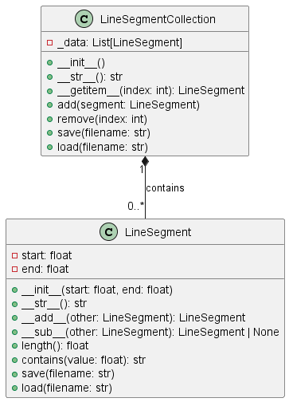

# Неделя 5, задание 1
## **Тема**: Объектно-ориентированное программирование на Python 
### Студентки группы ПИЖ-б-о-23-1(1) Алдабаевой Виктории Владимировны
#### Репозиторий Git: https://github.com/Pharrower/pizh2311_Aldabaeva <br><br>
**Номер варианта: 2**  
*Задание:*  
    4.3.5. Класс-контейнер LineSegmentCollection
    Создайте класс-контейнер, который будет содержать
набор объектов из предыдущей задачи. Например, класс LineSegmentCollection будет содержать объекты класса LineSegment.
    Для класса-контейнера предусмотрите:
- Специальные методы:
1. __init__(self, ...) - инициализация с необходимыми параметрами;
2. __str__(self) - представление объекта в удобном для человека виде;
3. __getitem__() - индексация и срез для класса-контейнера.
- Поля, методы и свойства:
1. поле _data - содержит набор данных;
2. метод add(self, value) - Добавляет элемент Value в контейнер;
3. метод remove(self, index) - удаляет элемент из контейнера по индексу index;
4. метод save(self, filename) - сохраняет объект в JSON-файл filename;
5. метод load(self, filename) - заружает объект из JSON-файла filename.

    При выполнении задания необходимо построить
UML-диаграмму классов приложения.

*Ответ:* 

*LineSegment.py*
```python
import json

class LineSegment:
    """
    Класс, представляющий математический интервал (отрезок) на числовой прямой.

    Атрибуты:
        start (float): Начало интервала.
        end (float): Конец интервала.
    """

    def __init__(self, start, end):
        """
        Инициализация объекта LineSegment.

        Параметры:
            start (float): Начало интервала.
            end (float): Конец интервала.

        Исключения:
            ValueError: Если start > end.
        """
        if start > end:
            raise ValueError("Начало интервала не может быть больше конца.")
        self.start = start
        self.end = end

    def __str__(self):
        """
        Возвращает строковое представление интервала.

        Возвращаемое значение:
            str: Строка в формате "Интервал(start, end)".
        """
        return f"Интервал({self.start}, {self.end})"

    def __add__(self, other):
        """
        Перегрузка оператора сложения. Объединяет два интервала.

        Параметры:
            other (LineSegment): Другой интервал для объединения.

        Возвращаемое значение:
            LineSegment: Новый интервал, охватывающий оба исходных.
        """
        return LineSegment(min(self.start, other.start), max(self.end, other.end))

    def __sub__(self, other):
        """
        Перегрузка оператора вычитания. Находит пересечение двух интервалов.

        Параметры:
            other (LineSegment): Другой интервал для нахождения пересечения.

        Возвращаемое значение:
            LineSegment: Новый интервал, представляющий пересечение.
            None: Если пересечения нет.
        """
        new_start = max(self.start, other.start)
        new_end = min(self.end, other.end)
        if new_start > new_end:
            return None  # Нет пересечения
        return LineSegment(new_start, new_end)

    def length(self):
        """
        Вычисляет длину интервала.

        Возвращаемое значение:
            float: Длина интервала.
        """
        return self.end - self.start

    def contains(self, value):
        """
        Проверяет, содержится ли значение в интервале.

        Параметры:
            value (float): Значение для проверки.

        Возвращаемое значение:
            str: Да или нет
        """
        if self.start <= value <= self.end:
            print(f"Да, значение {value} содержится в данном интервале")
        else:
            print(f"Нет, значение {value} не содержится в данном интервале")

    def save(self, filename):
        """
        Сохраняет интервал в JSON-файл.

        Параметры:
            filename (str): Имя файла для сохранения.
        """
        data = {'start': self.start, 'end': self.end}
        with open(filename, 'w') as file:
            json.dump(data, file)

    def load(self, filename):
        """
        Загружает интервал из JSON-файла.

        Параметры:
            filename (str): Имя файла для загрузки.
        """
        with open(filename, 'r') as file:
            data = json.load(file)
        self.start = data['start']
        self.end = data['end']
```  

*LineSegmentCollection.py*
```python
import json
from LineSegment import LineSegment

class LineSegmentCollection:
    """
    Класс-контейнер для хранения объектов LineSegment.
    """

    def __init__(self):
        """
        Инициализация контейнера.
        """
        self._data = []

    def __str__(self):
        """
        Возвращает строковое представление контейнера.
        """
        return "\n".join(f"{i}: {segment}" for i, segment in enumerate(self._data))

    def __getitem__(self, index):
        """
        Возвращает элемент контейнера по индексу.
        """
        return self._data[index]

    def add(self, segment):
        """
        Добавляет объект LineSegment в контейнер.

        Параметры:
            segment (LineSegment): Объект LineSegment для добавления.
        """
        self._data.append(segment)
        print(f"{segment} добавлен в коллекцию.")

    def remove(self, index):
        """
        Удаляет объект LineSegment из контейнера по индексу.

        Параметры:
            index (int): Индекс элемента для удаления.
        """
        if 0 <= index < len(self._data):
            removed_segment = self._data.pop(index)
            print(f"{removed_segment} удален из коллекции.")
        else:
            print("Ошибка: Интервала с таким индексом не существует.")

    def save(self, filename):
        """
        Сохраняет контейнер в JSON-файл.

        Параметры:
            filename (str): Имя файла для сохранения.
        """
        data = [{'start': segment.start, 'end': segment.end} for segment in self._data]
        with open(filename, 'w') as file:
            json.dump(data, file)
        print(f"Коллекция сохранена в файл {filename}.")

    def load(self, filename):
        """
        Загружает контейнер из JSON-файла.

        Параметры:
            filename (str): Имя файла для загрузки.
        """
        with open(filename, 'r') as file:
            data = json.load(file)
        self._data = [LineSegment(segment['start'], segment['end']) for segment in data]
        print(f"Коллекция загружена из файла {filename}.")
```

*main.py*
```python
from LineSegment import LineSegment
from LineSegmentCollection import LineSegmentCollection

def display_menu():
    """
    Отображает меню для пользователя.
    """
    print("\nМеню:")
    print("1. Просмотреть коллекцию")
    print("2. Добавить интервал")
    print("3. Удалить интервал")
    print("4. Сохранить коллекцию в файл")
    print("5. Загрузить коллекцию из файла")
    print("6. Выйти")

def main():
    collection = LineSegmentCollection()

    while True:
        display_menu()
        choice = input("Выберите действие: ")

        if choice == '1':
            print("\nТекущая коллекция интервалов:")
            print(collection)
        elif choice == '2':
            try:
                start = float(input("Введите начало интервала: "))
                end = float(input("Введите конец интервала: "))
                segment = LineSegment(start, end)
                collection.add(segment)
            except ValueError as e:
                print(f"Ошибка: {e}")
        elif choice == '3':
            try:
                index = int(input("Введите индекс интервала для удаления: "))
                collection.remove(index)
            except ValueError:
                print("Ошибка: Введите корректный индекс.")
        elif choice == '4':
            filename = input("Введите имя файла для сохранения: ")
            if filename.find('.json') == -1:
                filename += '.json'
            collection.save(filename)
        elif choice == '5':
            filename = input("Введите имя файла для загрузки: ")
            collection.load(filename)
        elif choice == '6':
            print("Выход из программы.")
            break
        else:
            print("Неверный выбор. Пожалуйста, выберите действие от 1 до 6.")

if __name__ == "__main__":
    main()

# Пример вывода:

#Меню:
#1. Просмотреть коллекцию       
#2. Добавить интервал
#3. Удалить интервал
#4. Сохранить коллекцию в файл  
#5. Загрузить коллекцию из файла
#6. Выйти
#Выберите действие: 2
#Введите начало интервала: 1
#Введите конец интервала: 5
#Интервал(1.0, 5.0) добавлен в коллекцию.

#Меню:
#1. Просмотреть коллекцию
#2. Добавить интервал
#3. Удалить интервал
#4. Сохранить коллекцию в файл
#5. Загрузить коллекцию из файла
#6. Выйти
#Выберите действие: 2
#Введите начало интервала: 3
#Введите конец интервала: 7
#Интервал(3.0, 7.0) добавлен в коллекцию.

#Меню:
#1. Просмотреть коллекцию
#2. Добавить интервал
#3. Удалить интервал
#4. Сохранить коллекцию в файл
#5. Загрузить коллекцию из файла
#6. Выйти
#Выберите действие: 1

#Текущая коллекция интервалов:
#0: Интервал(1.0, 5.0)
#1: Интервал(3.0, 7.0)

#Меню:
#1. Просмотреть коллекцию
#2. Добавить интервал
#3. Удалить интервал
#4. Сохранить коллекцию в файл
#5. Загрузить коллекцию из файла
#6. Выйти
#Выберите действие: 3
#Введите индекс интервала для удаления: 0
#Интервал(1.0, 5.0) удален из коллекции.

#Меню:
#1. Просмотреть коллекцию
#2. Добавить интервал
#3. Удалить интервал
#4. Сохранить коллекцию в файл
#5. Загрузить коллекцию из файла
#6. Выйти
#Выберите действие: 4
#Введите имя файла для сохранения: collection
#Коллекция сохранена в файл collection.json.

#Меню:
#1. Просмотреть коллекцию
#2. Добавить интервал
#3. Удалить интервал
#4. Сохранить коллекцию в файл
#5. Загрузить коллекцию из файла
#6. Выйти
#Выберите действие: 5
#Введите имя файла для загрузки: collection.json
#Коллекция загружена из файла collection.json.

#Меню:
#1. Просмотреть коллекцию
#2. Добавить интервал
#3. Удалить интервал
#4. Сохранить коллекцию в файл
#5. Загрузить коллекцию из файла
#6. Выйти
#Выберите действие: 6
#Выход из программы.
```

**UML** <br>
