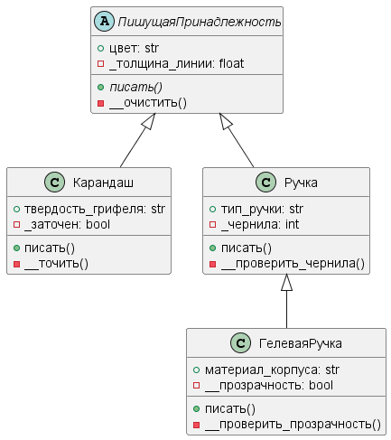

# Неделя 5, задание 2
## **Тема**: Объектно-ориентированное программирование на Python 
### Студентки группы ПИЖ-б-о-23-1(1) Алдабаевой Виктории Владимировны
#### Репозиторий Git: https://github.com/Pharrower/pizh2311_Aldabaeva <br><br>
**Номер варианта: 2**  
*Задание:*  
    4.3.6. Иерархия классов
Вариант №2
Классы: ПишущаяПринадлежность, Карандаш, Ручка, ГелеваяРучка
Методы базовоо класса: писать()
    Далее:
- выстройте классы в иерархию, продумайт их общие и отличительные характеристики и действия;
- добавьте собственную реализацию методов базового класса в каждый из классов, предусмотрев:
    1. необходимые параметры для базовых методов;
    2. необходимые поля для функциональности базовых методов. Классы должны содержать как минимум по одному общедоступному, не общедоступному и закрытому полю/методу;
    3. вывод на экран работы метода.
- по желанию добавьте собственные методы в классы иерархии.
    Реализуйте все классы в отдельном модуле, а также создайте Main.py, который бы тестировал все его возможности.
    По согласованию иерархия моет быть 
*Ответ:* 

*ПишущиеПринадлежности.py*
```python
from abc import ABC, abstractmethod

class ПишущаяПринадлежность(ABC):
    """
    Абстрактный базовый класс для всех пишущих принадлежностей.
    Определяет общие свойства и методы для всех пишущих инструментов.
    """
    def __init__(self, цвет, толщина_линии):
        """
        Инициализация пишущей принадлежности.

        :param цвет: Цвет пишущего инструмента.
        :param толщина_линии: Толщина линии, которую оставляет инструмент.
        """
        self.цвет = цвет
        self.толщина_линии = толщина_линии

    @abstractmethod
    def писать(self):
        """
        Абстрактный метод, который должен быть реализован в подклассах.
        Определяет, как пишущая принадлежность будет "писать".
        """
        pass

class Карандаш(ПишущаяПринадлежность):
    """
    Класс, представляющий карандаш. Наследует от ПишущаяПринадлежность.
    """
    def __init__(self, цвет, толщина_линии, твердость_грифеля):
        """
        Инициализация карандаша.

        :param цвет: Цвет карандаша.
        :param толщина_линии: Толщина линии, которую оставляет карандаш.
        :param твердость_грифеля: Твердость грифеля карандаша (например, HB, 2B).
        """
        super().__init__(цвет, толщина_линии)
        self.твердость_грифеля = твердость_грифеля

    def писать(self):
        """
        Реализация метода писать для карандаша.
        Выводит информацию о цвете, толщине линии и твердости грифеля.
        """
        print(f"Карандаш пишет цветом: {self.цвет}, толщина линии: {self.толщина_линии}, твёрдость грифеля: {self.твердость_грифеля}")

class Ручка(ПишущаяПринадлежность):
    """
    Класс, представляющий ручку. Наследует от ПишущаяПринадлежность.
    """
    def __init__(self, цвет, толщина_линии, тип_ручки):
        """
        Инициализация ручки.

        :param цвет: Цвет ручки.
        :param толщина_линии: Толщина линии, которую оставляет ручка.
        :param тип_ручки: Тип ручки (например, шариковая, гелевая).
        """
        super().__init__(цвет, толщина_линии)
        self.тип_ручки = тип_ручки

    def писать(self):
        """
        Реализация метода писать для ручки.
        Выводит информацию о цвете, толщине линии и типе ручки.
        """
        print(f"Ручка пишет цветом: {self.цвет}, толщина линии: {self.толщина_линии}, тип ручки: {self.тип_ручки}.")

class ГелеваяРучка(Ручка):
    """
    Класс, представляющий гелевую ручку. Наследует от Ручка.
    """
    def __init__(self, цвет, толщина_линии, тип_ручки, материал_корпуса):
        """
        Инициализация гелевой ручки.

        :param цвет: Цвет гелевой ручки.
        :param толщина_линии: Толщина линии, которую оставляет гелевая ручка.
        :param тип_ручки: Тип ручки (например, гелевая).
        :param материал_корпуса: Материал корпуса ручки (например, алюминий, пластик).
        """
        super().__init__(цвет, толщина_линии, тип_ручки)
        self.материал_корпуса = материал_корпуса

    def писать(self):
        """
        Реализация метода писать для гелевой ручки.
        Выводит информацию о типе ручки, цвете, толщине линии и материале корпуса.
        """
        print(f"Тип ручки: Гелевая, ручка пишет цветом: {self.цвет}, толщина линии: {self.толщина_линии}, материал корпуса: {self.материал_корпуса}.")
```

*main.py*
```python
from ПишущиеПринадлежности import ПишущаяПринадлежность
from ПишущиеПринадлежности import Карандаш
from ПишущиеПринадлежности import Ручка
from ПишущиеПринадлежности import ГелеваяРучка

def main():
    print("Создание пишущих принадлежностей:")
    
    # Ввод данных для карандаша
    print("\nСоздание карандаша:")
    цвет_карандаша = input("Введите цвет карандаша: ")
    толщина_карандаша = float(input("Введите толщину линии карандаша: "))
    твердость_грифеля = input("Введите твердость грифеля (например, HB, 2B): ")
    
    карандаш = Карандаш(цвет_карандаша, толщина_карандаша, твердость_грифеля)
    
    # Ввод данных для ручки
    print("\nСоздание ручки:")
    цвет_ручки = input("Введите цвет ручки: ")
    толщина_ручки = float(input("Введите толщину линии ручки: "))
    тип_ручки = input("Введите тип ручки (например, шариковая, гелевая): ")
    
    ручка = Ручка(цвет_ручки, толщина_ручки, тип_ручки)
    
    # Ввод данных для гелевой ручки
    print("\nСоздание гелевой ручки:")
    цвет_гелевой_ручки = input("Введите цвет гелевой ручки: ")
    толщина_гелевой_ручки = float(input("Введите толщину линии гелевой ручки: "))
    материал_корпуса = input("Введите материал корпуса ручки: (например: алюминий, пластик) ")
    
    гелевая_ручка = ГелеваяРучка(цвет_гелевой_ручки, толщина_гелевой_ручки, тип_ручки, материал_корпуса)
    
    # Демонстрация работы методов
    print("\nРезультаты:")
    print("Карандаш:")
    карандаш.писать()
    
    print("\nРучка:")
    ручка.писать()
    
    print("\nГелевая ручка:")
    гелевая_ручка.писать()

if __name__ == "__main__":
    main()

#Пример вывода:

#Создание пишущих принадлежностей:

#Создание карандаша:     
#Введите цвет карандаша: чёрный
#Введите толщину линии карандаша: 0.7
#Введите твердость грифеля (например, HB, 2B): B

#Создание ручки:     
#Введите цвет ручки: красный
#Введите толщину линии ручки: 0.2
#Введите тип ручки (например, шариковая, гелевая): шариковая

#Создание гелевой ручки:     
#Введите цвет гелевой ручки: синий
#Введите толщину линии гелевой ручки: 0.4
#Введите материал корпуса ручки: (например: алюминий, пластик) пластик

#Результаты:
#Карандаш:
#Карандаш пишет цветом: чёрный, толщина линии: 0.7, твёрдость грифеля: B

#Ручка:
#Ручка пишет цветом: красный, толщина линии: 0.2, тип ручки: шариковая.

#Гелевая ручка:
#Тип ручки: Гелевая, ручка пишет цветом: синий, толщина линии: 0.4, материал корпуса: пластик.
```

**UML** <br>
