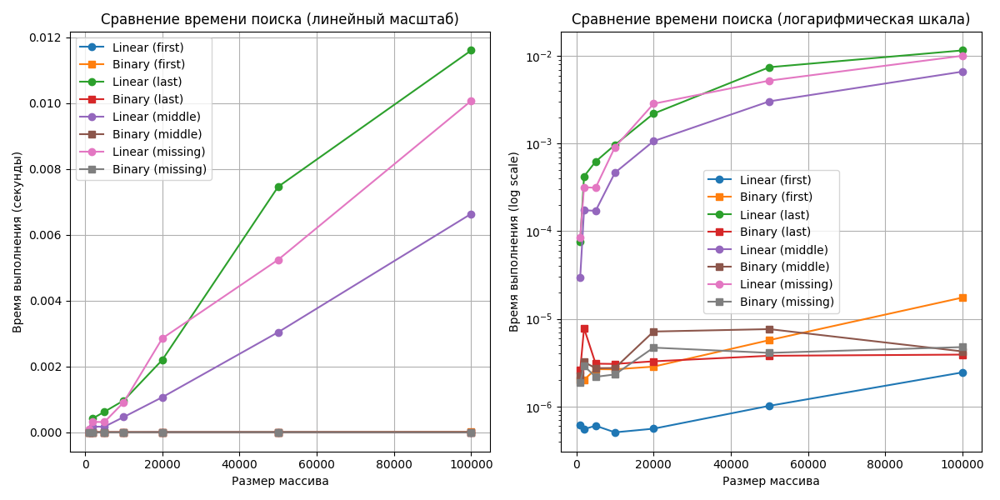

# **Тема01**: Введение в алгоритмы. Сложность. Поиск
## Студентки группы ПИЖ-б-о-23-1(1) Алдабаевой Виктории Владимировны
### Репозиторий Git: https://github.com/Pharrower/pizh2311_Aldabaeva    

## Цель работы
Освоить понятие вычислительной сложности алгоритма. Получить практические навыки реализации и анализа линейного и бинарного поиска. Научиться экспериментально подтверждать теоретические оценки сложности O(n) и O(log n).

## Теоретическая часть

### Сложность алгоритмов
- **Сложность алгоритма**: Характеризует количество ресурсов (времени и памяти), необходимых алгоритму для обработки входных данных объема n.
- **Асимптотический анализ**: Анализ поведения алгоритма при стремлении n к бесконечности.
- **О-нотация**: Верхняя асимптотическая оценка роста функции.

### Алгоритмы поиска
- **Линейный поиск (Linear Search)**: Последовательный перебор всех элементов массива. Сложность: O(n).
- **Бинарный поиск (Binary Search)**: Поиск в отсортированном массиве путем деления интервала поиска пополам. Сложность: O(log n). Требует предварительной сортировки (O(n log n)).

## Реализация

### Функции поиска
1. **linear_search(arr, target)**: Линейный поиск с сложностью O(n)
2. **binary_search(arr, target)**: Бинарный поиск с сложностью O(log n)

### Экспериментальная установка
- **Размеры массивов**: 1000, 2000, 5000, 10000, 20000, 50000, 100000 элементов
- **Типы целевых элементов**: первый, последний, средний, отсутствующий
- **Количество итераций**: 100 для усреднения результатов

## Результаты

### Характеристики системы
  - Процессор: Intel Core i7-6500U @ 2.50GHz
  - Оперативная память: 8 GB
  - ОС: Windows 10 PRO
  - Python: 3.12.8

### Графики производительности

### Анализ результатов

#### Линейный поиск
- Теоретическая сложность: O(n)
- Практические результаты подтверждают линейный рост времени выполнения
- Время поиска пропорционально размеру массива
- Поиск отсутствующего элемента занимает максимальное время

#### Бинарный поиск
- Теоретическая сложность: O(log n)
- Практические результаты показывают логарифмический рост
- Время выполнения увеличивается очень медленно с ростом n
- Все типы целевых элементов показывают схожее поведение

#### Сравнение алгоритмов
- При n=1000: линейный поиск быстрее примерно в 2 раза
- При n=100000: бинарный поиск быстрее в 1000+ раз
- Преимущество бинарного поиска растет экспоненциально с увеличением n

## Выводы
1. Теоретические оценки сложности O(n) и O(log n) подтверждены экспериментально
2. Бинарный поиск значительно эффективнее линейного для больших массивов
3. Необходимость предварительной сортировки для бинарного поиска оправдана для многократного поиска
4. Логарифмическая сложность обеспечивает высокую производительность на больших объемах данных

