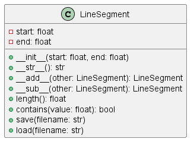

# Неделя 4, задание 2
## **Тема**: Объектно-ориентированное программирование на Python 
### Студентки группы ПИЖ-б-о-23-1(1) Алдабаевой Виктории Владимировны
#### Репозиторий Git: https://github.com/Pharrower/pizh2311_Aldabaeva <br><br>
**Номер варианта: 2**  
*Задание:*  
4.3.4. Простой класс 
Номер варианта: 2
Наименование класса: LineSegment
Описание: Математический интервал

- изучите предметную область и доступные операции;
- для каждого поля придумайте его область видимости, а также необходимость использования свойств.
Класс должен содержать:
- __init__(self, ...) - инициализация с необходимыми параметрами
- __str__(self) - представление объекта в удобном для человека виде;
- специальные методы для возможности сложения, разности и прочих операций, которые класс должен поддерживать.
- метод save(self,filename) - сохраняет объект в JSON-файл
- метод load(self,filename) - заружает объект из JSON-файла

*Ответ:* 

*roman.py*
```python
import json

class LineSegment:
    """
    Класс, представляющий математический интервал (отрезок) на числовой прямой.

    Атрибуты:
        start (float): Начало интервала.
        end (float): Конец интервала.
    """

    def __init__(self, start, end):
        """
        Инициализация объекта LineSegment.

        Параметры:
            start (float): Начало интервала.
            end (float): Конец интервала.

        Исключения:
            ValueError: Если start > end.
        """
        if start > end:
            raise ValueError("Начало интервала не может быть больше конца.")
        self.start = start
        self.end = end

    def __str__(self):
        """
        Возвращает строковое представление интервала.

        Возвращаемое значение:
            str: Строка в формате "Интервал(start, end)".
        """
        return f"Интервал({self.start}, {self.end})"

    def __add__(self, other):
        """
        Перегрузка оператора сложения. Объединяет два интервала.

        Параметры:
            other (LineSegment): Другой интервал для объединения.

        Возвращаемое значение:
            LineSegment: Новый интервал, охватывающий оба исходных.
        """
        return LineSegment(min(self.start, other.start), max(self.end, other.end))

    def __sub__(self, other):
        """
        Перегрузка оператора вычитания. Находит пересечение двух интервалов.

        Параметры:
            other (LineSegment): Другой интервал для нахождения пересечения.

        Возвращаемое значение:
            LineSegment: Новый интервал, представляющий пересечение.
            None: Если пересечения нет.
        """
        new_start = max(self.start, other.start)
        new_end = min(self.end, other.end)
        if new_start > new_end:
            return None  # Нет пересечения
        return LineSegment(new_start, new_end)

    def length(self):
        """
        Вычисляет длину интервала.

        Возвращаемое значение:
            float: Длина интервала.
        """
        return self.end - self.start

    def contains(self, value):
        """
        Проверяет, содержится ли значение в интервале.

        Параметры:
            value (float): Значение для проверки.

        Возвращаемое значение:
            str: Да или нет
        """
        if self.start <= value <= self.end:
            print(f"Да, значение {value} содержится в данном интервале")
        else:
            print(f"Нет, значение {value} не содержится в данном интервале")

    def save(self, filename):
        """
        Сохраняет интервал в JSON-файл.

        Параметры:
            filename (str): Имя файла для сохранения.
        """
        data = {'start': self.start, 'end': self.end}
        with open(filename, 'w') as file:
            json.dump(data, file)

    def load(self, filename):
        """
        Загружает интервал из JSON-файла.

        Параметры:
            filename (str): Имя файла для загрузки.
        """
        with open(filename, 'r') as file:
            data = json.load(file)
        self.start = data['start']
        self.end = data['end']
```  

*main.py*
```python
from math import pi
from LineSegment import LineSegment

def main():
    # Ввод первого интервала
    start1, end1 = map(float, input("Введите первый интервал в формате 'start,end': ").split(','))
    segment1 = LineSegment(start1, end1)

    # Ввод второго интервала
    start2, end2 = map(float, input("Введите первый интервал в формате 'start,end': ").split(','))
    segment2 = LineSegment(start2, end2)

    # Вывод информации о интервалах
    print("\nВведенные интервалы:")
    print("Интервал 1:", segment1)
    print("Интервал 2:", segment2)

    # Операции с интервалами
    sum_segment = segment1 + segment2
    diff_segment = segment1 - segment2

    print("\nРезультаты операций:")
    print("Сумма интервалов:", sum_segment)
    print("Пересечение интервалов:", diff_segment)

    # Длина интервалов
    print("\nДлины интервалов:")
    print("Длина интервала 1:", segment1.length())
    print("Длина интервала 2:", segment2.length())

    # Проверка на содержание значения
    value = float(input("\nВведите значение для проверки в интервале 1: "))
    print("Интервал 1: ")
    segment1.contains(value)
    print("Интервал 2:")
    segment2.contains(value)

    # Сохранение и загрузка интервала
    save_option = input("\nХотите сохранить интервал 1 в файл? (да/нет): ").lower()
    if save_option == 'да':
        filename = input("Введите имя файла для сохранения: ")
        if filename.find('.json') == -1:
            filename += '.json'
        segment1.save(filename)
        print(f"Интервал 1 сохранен в файл '{filename}'.")

        load_option = input("Хотите загрузить интервал из файла? (да/нет): ").lower()
        if load_option == 'да':
            loaded_segment = LineSegment(0, 0)
            loaded_segment.load(filename)
            print("Загруженный интервал:", loaded_segment)

if __name__ == "__main__":
    main()

# Пример вывода:

#Введите первый интервал в формате 'start,end': 1,5
#Введите первый интервал в формате 'start,end': 3,7

#Введенные интервалы:
#Интервал 1: Интервал(1.0, 5.0)
#Интервал 2: Интервал(3.0, 7.0)

#Результаты операций:
#Сумма интервалов: Интервал(1.0, 7.0)
#Пересечение интервалов: Интервал(3.0, 5.0)

#Длины интервалов:
#Длина интервала 1: 4.0
#Длина интервала 2: 4.0

#Введите значение для проверки в интервале 1: 2
#Интервал 1: 
#Да, значение 2.0 содержится в данном интервале
#Интервал 2:
#Нет, значение 2.0 не содержится в данном интервале

#Хотите сохранить интервал 1 в файл? (да/нет): да
#Введите имя файла для сохранения: file_1
#Интервал 1 сохранен в файл 'file_1.json'.
#Хотите загрузить интервал из файла? (да/нет): да
#Загруженный интервал: Интервал(1.0, 5.0)
```

**UML** <br>
